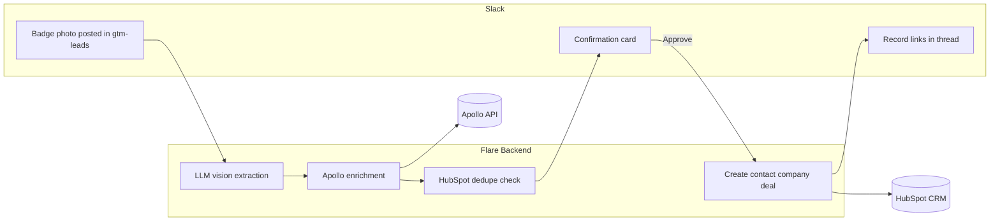
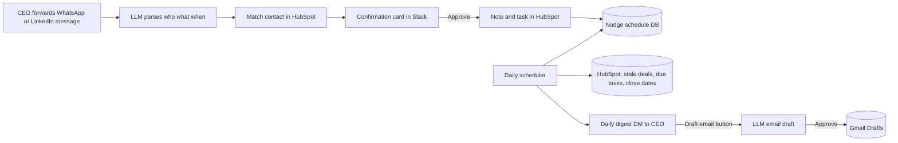

# PRD: FlairX GTM Slack Bot ("Flare")

| | |
|---|---|
| **Document status** | Draft v1.0 |
| **Author** | GTM Team (Aayush Narang) |
| **Last updated** | July 2, 2026 |
| **Audience** | Sections 1–5: exec / GTM team. Sections 6–9: engineering. |

---

## 1. Overview and Problem Statement

FlairX is an AI interview platform that conducts and scores candidate interviews end-to-end, helping recruiting teams cut time-to-hire. The GTM motion today is high-touch and conference-heavy, and three problems are slowing it down:

1. **Manual lead capture at conferences.** A GTM team member photographs a prospect's badge, then later manually transcribes name, email, company, employee count, open roles, etc. into a spreadsheet before it ever reaches a system of record. This is slow (often next-day), error-prone, and leads go cold before first contact.
2. **Follow-ups fall through the cracks.** The CEO owns most deal follow-ups, but her schedule means commitments made over email, WhatsApp, or LinkedIn ("let's talk in two weeks") are frequently forgotten. There is no system that reminds her — the reminder *is* her memory.
3. **Outbound and pipeline data are disconnected.** Apollo (outbound) and HubSpot (pipeline) exist, but nothing connects field-captured leads, messaging-app commitments, and deal-stage history into one place the team actually looks at: Slack.

**The solution** is a Slack bot — working name **Flare** — that lives in the FlairX Slack workspace and:

- Turns a badge photo into an enriched HubSpot contact + company + deal in under a minute.
- Sends the CEO a daily digest of deals needing attention, plus targeted nudges for specific commitments.
- Captures meeting commitments made on WhatsApp/LinkedIn via a simple forward-to-Slack flow.
- Drafts stage-aware follow-up emails and places approved drafts directly into the CEO's Gmail Drafts (the bot never sends).
- Answers natural-language pipeline questions and posts recurring pipeline summaries.

The interaction model follows the pattern the team already uses successfully with the FlairXSupport bug-ticketing bot (mention the bot, it does the work, it replies in-thread with a link to the created record).

### How this supports current GTM goals

| GTM goal | How Flare helps |
|---|---|
| Pipeline diagnosis (Session 1) | Stage-by-stage HubSpot data, surfaced in Slack, shows exactly where the funnel breaks — no leads, no conversion, or no closing |
| Customer review | Revenue, acquisition source, and sales-cycle length pulled directly from HubSpot deal records, not memory |
| ICP draft (Session 2) | Built from real win patterns in HubSpot data (industry, size, ATS in use), which Flare keeps complete via enrichment |
| Lead-gen experiments | Apollo runs outbound tests; HubSpot (fed by Flare) tracks which channels convert to revenue |
| Follow-up discipline | Flare reads deal stage from HubSpot to draft follow-ups, send reminders, and report daily updates |

---

## 2. Users and Personas

### P1 — GTM team member ("the field")
Attends conferences, collects badges/business cards, owns top-of-funnel. Needs lead capture to take seconds, not an evening of spreadsheet work. Primary user of **badge scan** and **pipeline Q&A**.

### P2 — CEO ("the closer")
Owns mid- and late-stage deals and all executive follow-ups. Extremely time-constrained; communicates with prospects across email, WhatsApp, and LinkedIn. Needs the bot to *remember for her* and to remove friction from writing follow-ups. Primary user of **reminders**, **commitment capture**, and **email drafting**.

### P3 — Broader team ("the audience")
Everyone else in the Slack workspace who benefits from ambient pipeline visibility: recurring summaries in a shared channel, and the ability to ask the bot questions without opening HubSpot.

---

## 3. Core Features

### 3.1 Badge Scan → HubSpot Lead

**User story:** *As a GTM team member at a conference, I want to photograph a badge and have a complete, enriched lead appear in HubSpot, so I never spend an evening transcribing spreadsheets again.*

**Flow:**

1. User posts a badge (or business card) photo in the `#gtm-leads` channel, optionally with context text: `@Flare met at SHRM 2026, hiring 20 engineers, wants demo`.
2. Flare runs LLM-vision extraction on the photo: full name, job title, company name, email (if printed), location.
3. Flare enriches via Apollo (People Match / waterfall enrichment): verified email, company size, industry vertical, growth stage/funding, hiring signals (open roles), technographics (current ATS/hiring tools).
4. Flare posts an **editable confirmation card** in-thread showing all extracted + enriched fields, with `Approve`, `Edit`, and `Discard` buttons. Any field can be corrected inline before approval.
5. On `Approve`, Flare:
   - Creates (or dedupes against) the HubSpot **contact**, **company**, and a **deal** in the **Prospecting** stage.
   - Sets `Lead source = <conference name>` (parsed from the message or prompted).
   - Logs the badge photo and context note on the contact timeline.
   - Replies in-thread with links to the created records — same UX as the JIRA bug bot.

**Example interaction:**

> **Aayush** *(posts photo)*: `@Flare met at SHRM 2026, hiring ~20 engineers, wants a demo in July`
>
> **Flare**: Here's what I found — please confirm:
> • **Jane Doe** — VP Talent Acquisition, **Acme Corp**
> • jane.doe@acme.com (verified via Apollo) · Acme: 850 employees, SaaS, Series C
> • Current ATS: Greenhouse · 23 open roles
> • Lead source: SHRM 2026 · Note: "hiring ~20 engineers, wants a demo in July"
> `[Approve]` `[Edit]` `[Discard]`
>
> **Aayush**: *(clicks Approve)*
>
> **Flare**: Created in HubSpot: [Contact: Jane Doe] · [Company: Acme Corp] · [Deal: Acme Corp — SHRM 2026 (Prospecting)]. I'll include this deal in follow-up tracking.

**Edge cases:**
- Photo unreadable / partial → Flare posts what it could extract and asks for the missing fields in-thread.
- Contact already exists in HubSpot → Flare flags the duplicate, shows the existing record, and offers `Update existing` / `Create new deal on existing contact`.
- Apollo has no match → lead is created from OCR data alone, flagged `enrichment: none` for later manual review.
- Multiple badges in one photo → Flare posts one confirmation card per person detected.
- Batch mode: multiple photos in one message are processed as a queue with one card each.

### 3.2 Follow-up Reminders and Daily Digest

**User story:** *As the CEO, I want a daily summary of deals needing my attention and targeted nudges for specific commitments, so nothing falls through the cracks even when my calendar is full.*

**Daily digest (DM to CEO, default 8:00 AM local):**

- **Overdue follow-ups** — deals whose next-step task date has passed.
- **Stale deals** — no logged activity beyond a per-stage threshold (defaults: Prospecting 7d, Initial Contact 5d, Demonstration 3d, Proposal Sent 3d, Negotiation 2d; configurable).
- **Closing soon** — deals with a close date within 7 days.
- **Commitments due** — nudges from WhatsApp/LinkedIn/email commitments (see 3.3).

Each digest line has action buttons: `[Draft email]` `[Snooze 1d/3d/1w]` `[Mark done]` `[Open in HubSpot]`.

**On-demand commands:**

| Command | Result |
|---|---|
| `/leads due` | Everything overdue or due today, most urgent first |
| `/leads stale [stage]` | Stale deals, optionally filtered to one pipeline stage |
| `/leads digest` | Run the daily digest now |
| `/leads remind <contact> <when> [note]` | Manually schedule a nudge, e.g. `/leads remind Jane Doe in 2 weeks re: demo scheduling` |

**Escalation:** a nudge that is neither actioned nor snoozed re-fires the next day, and after 3 misses is flagged in the digest with an `OVERDUE 3+ days` marker.

**Data source:** all reminder logic reads from HubSpot (deal stage, tasks, last-activity timestamps). Flare never keeps its own parallel copy of deal truth — it only stores scheduling state (what nudge fires when).

### 3.3 WhatsApp / LinkedIn Commitment Capture (Forward-to-Slack)

**User story:** *As the CEO, when a client messages me on WhatsApp or LinkedIn to set up a meeting in two weeks, I want to forward that message to Slack and have the bot remember it for me, so a messaging-app promise carries the same weight as a CRM task.*

**Flow:**

1. CEO forwards the message content into Slack — either paste the text or drop a screenshot — and mentions the bot: `@Flare from WhatsApp:` + screenshot, or `@Flare LinkedIn — Raj from TalentWorks wants to meet in 2 weeks to discuss pilot pricing`.
2. Flare parses it (LLM text parsing; LLM vision for screenshots) and extracts: **who** (contact name/company), **what** (the commitment), **when** (resolves relative dates like "in two weeks" against the message date), and **channel** (WhatsApp/LinkedIn).
3. Flare matches the person against HubSpot contacts (fuzzy name + company match). Ambiguous match → Flare asks: "Did you mean Raj Patel (TalentWorks) or Raj Kumar (TalentHub)?"
4. Flare posts a confirmation card: contact, commitment, due date, associated deal. On approve, it:
   - Logs a **note** on the HubSpot contact/deal timeline ("WhatsApp 7/2: wants meeting ~7/16 re: pilot pricing", screenshot attached).
   - Creates a HubSpot **task** with the due date, assigned to the CEO.
   - Schedules a Slack **nudge**: reminder 2 days before the due date and on the day, with `[Draft email]` / `[Snooze]` / `[Done]` buttons; escalates per 3.2 if ignored.

**Example interaction:**

> **CEO**: `@Flare from WhatsApp:` *(screenshot: "Great meeting you at SHRM! Let's set up a call in two weeks to go over pilot pricing — Raj")*
>
> **Flare**: Got it. Logging this commitment:
> • **Raj Patel** — TalentWorks (matched to HubSpot deal: *TalentWorks — Proposal Sent*)
> • Commitment: call re: pilot pricing · Due: **~July 16** (2 weeks from message)
> • Source: WhatsApp (screenshot attached to HubSpot note)
> `[Confirm]` `[Edit date]` `[Wrong contact]`
>
> **CEO**: *(clicks Confirm)*
>
> **Flare**: Done. Task created in HubSpot, and I'll nudge you on **July 14** and **July 16**.

**Deliberate design choice — no direct WhatsApp/LinkedIn API integration in v1:**
- WhatsApp Business API cannot read a personal WhatsApp inbox; LinkedIn has no official messaging API for this use case, and unofficial access risks account restriction.
- Forward-to-Slack costs nothing, ships in Phase 2, carries zero ToS risk, and the forwarding step doubles as human confirmation of what matters.
- Automatic inbox monitoring via a unified-messaging API (e.g. Unipile, ~$50–100/mo) is documented as a future consideration in Section 9.

### 3.4 Email Drafting (Gmail)

**User story:** *As the CEO, I want the bot to draft a context-aware follow-up and put it in my Gmail Drafts after I approve it, so following up takes one click instead of twenty minutes.*

**Flow:**

1. Triggered from a digest/nudge button (`Draft email`), or on demand: `@Flare draft a follow-up to Jane Doe about scheduling the demo`.
2. Flare pulls context from HubSpot: deal stage, timeline notes (including badge-capture context and messaging commitments), last contact date, contact's preferred communication method.
3. Flare generates a **stage-aware** draft:
   - *Prospecting* → warm intro referencing where you met.
   - *Initial Contact* → value prop + demo ask.
   - *Demonstration* → demo recap + next-step proposal.
   - *Proposal Sent* → gentle nudge referencing the proposal.
   - *Negotiation* → momentum-keeper addressing open items.
4. Draft is posted in Slack with `[Approve → Gmail Drafts]` `[Revise]` (free-text feedback, e.g. "shorter, mention the SHRM keynote") `[Discard]`.
5. On approve, Flare creates the draft in the CEO's **Gmail Drafts** via the Gmail API — recipient, subject, and body pre-filled. **The bot never sends.** The CEO opens Gmail, gives it a final glance, and hits send herself. Flare logs "draft created" on the HubSpot deal timeline.

**Division of labor with Apollo:**
- **1:1 relationship-stage follow-ups** (this feature) → Gmail Drafts, CEO's personal voice and address.
- **Cold bulk outbound** → Apollo sequences, managed in Apollo. Sending sequence emails consumes **no Apollo credits** (email sending is unlimited under fair use, ~500/day/user on Basic); credits are only consumed by data reveals/exports, not sending. Flare can add an approved contact to a named Apollo sequence on request: `@Flare add Jane Doe to the "SHRM follow-up" sequence`.

### 3.5 Pipeline Q&A and Reporting

**User story:** *As anyone on the team, I want to ask pipeline questions in plain English and get recurring summaries in Slack, so HubSpot's data is ambient rather than buried.*

**Natural-language Q&A (mention the bot anywhere it's invited):**
- `@Flare what's in Negotiation right now?`
- `@Flare show me all deals from SHRM 2026`
- `@Flare which deals have been stuck in Proposal Sent the longest?`
- `@Flare what did we close-lose last quarter and why?` (aggregates `loss reason` and `competitor evaluated`)

Flare translates the question into HubSpot CRM Search API queries and answers with a formatted summary plus record links. Questions it cannot map safely get a clarifying question, never a guessed answer.

**Recurring reports (posted to `#gtm-pipeline`):**
- **Daily**: deals moved between stages in the last 24h, new leads created, tasks completed.
- **Weekly**: funnel snapshot — count and value per stage, week-over-week stage-conversion rates, average days-in-stage, win/loss tally with loss reasons. This is the direct input for the Session 1 pipeline diagnosis ("where does the funnel break?") and Session 2 ICP work (win patterns by industry, size, ATS).

---

## 4. Non-Goals

- **Flare never sends email autonomously.** It creates Gmail drafts only; a human always presses send. (Apollo sequences send, but those are configured and owned inside Apollo.)
- **Flare never auto-advances deal stages.** Stage changes are human decisions made in HubSpot; the bot reads stages, it does not write them.
- **Flare does not replace HubSpot as the system of record.** It stores no CRM data of its own beyond nudge-scheduling state and Slack↔HubSpot ID mappings.
- **No direct WhatsApp/LinkedIn API integration in v1** (see 3.3).
- **No calendar booking.** Flare reminds about meetings; it does not schedule them (a Calendly/Google Calendar integration is a possible future addition).
- **Not a general-purpose assistant.** Scope is GTM: leads, deals, follow-ups, reporting.

---

## 5. Success Metrics

| Metric | Baseline (today) | Target (90 days post-launch) |
|---|---|---|
| Badge → CRM record time | Hours to next-day (manual) | < 2 minutes |
| Conference leads entered into CRM | Partial (spreadsheet attrition) | 100% of scanned badges |
| Follow-up SLA (task done by due date) | Untracked, anecdotally poor | ≥ 80% |
| Messaging commitments tracked in CRM | ~0% | ≥ 90% of forwarded commitments |
| % conference leads reaching Initial Contact within 7 days | Unknown | ≥ 60% |
| CEO time on follow-up admin | Est. 3–5 hrs/week | < 1 hr/week |
| Data completeness on new leads (email, size, industry, ATS) | Sparse | ≥ 85% of fields auto-filled |

Instrumentation: Flare logs every action (scan, approve, nudge fired, nudge actioned, draft created) so these metrics are reportable from the bot's own event log plus HubSpot.

---

## 6. Technical Architecture

### 6.1 Components

- **Slack app** (Bolt for JavaScript/TypeScript or Python, Socket Mode for v1 to avoid public-endpoint setup): Events API subscriptions for `app_mention` and `file_shared`, slash commands (`/leads …`), Block Kit interactive cards (approve/edit/snooze buttons), scheduled DMs.
- **Backend service** (single small Node/Python service, deployable on Render/Railway/Fly): webhook handlers, the reminder scheduler (cron), and integration clients. A lightweight Postgres (or SQLite for v1) stores nudge schedules, Slack↔HubSpot ID mappings, and the event log.
- **LLM layer**: vision model (e.g. GPT-4o or Claude) for badge OCR and screenshot parsing with structured-output JSON schemas; text model for commitment parsing, email drafting, and NL→CRM-query translation.
- **Integration clients**: HubSpot (private app), Apollo (REST API), Gmail (OAuth), Slack (bot token).

### 6.2 Data flows

**Badge scan flow:**

**Reminder / commitment flow:**

### 6.3 Reminder engine

- Cron job (every 15 min) evaluates: HubSpot tasks due, per-stage staleness thresholds, close dates within window, and locally scheduled nudges.
- Nudges are idempotent (one nudge per deal per rule per day) and stateful (snooze/done/escalation-count stored locally).
- HubSpot is polled rather than webhook-driven in v1 (simpler; Starter API limits make polling every 15 min trivially cheap). Migration to HubSpot webhooks is a later optimization.

### 6.4 Security and privacy

- All tokens (Slack, HubSpot, Apollo, Gmail OAuth refresh token) stored as environment secrets; never in code or Slack.
- Gmail scope restricted to `gmail.compose` — the narrowest scope that supports draft creation; it grants **no inbox read access**. The scope technically permits sending, so the guarantee that the bot never sends is enforced in code: the send endpoint is never called, only `drafts.create`.
- Badge photos and screenshots are transferred to HubSpot attachments and not retained by the backend beyond processing.
- Bot only operates in channels it is explicitly invited to; digest DMs go only to the CEO.
- Event log contains record IDs and actions, not message bodies.

---

## 7. Integrations and Plan Constraints

### 7.1 HubSpot — Sales Hub Starter

- **Auth**: private app access token (no marketplace listing needed).
- **APIs used**: CRM objects (contacts, companies, deals), associations, tasks/notes (engagements), CRM Search, pipelines API (to read the 7 stages: Prospecting → Initial Contact → Demonstration → Proposal Sent → Negotiation → Closed Won / Closed Lost).
- **Rate limits (Starter, private app)**: 100 requests / 10 seconds, 250,000 / day — orders of magnitude above expected usage (a heavy conference day is a few hundred calls).
- **Key constraint**: workflow-triggered Slack actions in HubSpot require Professional tier. This is precisely why Flare is a **custom Slack app talking to the HubSpot API directly** rather than relying on HubSpot's native Slack integration, which on Starter only supports basic notifications and slash-command search.
- **Prerequisite setup (one-time, manual)**: create the custom properties listed in Section 8 and the 7-stage pipeline before launch. See the step-by-step [HUBSPOT_SETUP.md](HUBSPOT_SETUP.md) checklist.

### 7.2 Apollo — Basic Plan

- **API access**: included on Basic (basic-tier API; advanced endpoints and higher rate limits are on higher tiers). Usage is metered from the same credit pool as the UI.
- **Sequences**: unlimited active sequences on Basic (vs. 2 on Free) — the feature that makes Apollo the right home for bulk outbound.
- **Credit model** (what actually costs credits):
  - Verified email reveal: **1 credit**. Phone reveal: **8 credits** (avoid unless needed).
  - Export credits consumed when syncing enriched contacts out of Apollo (CSV/CRM/API enrichment) — Basic includes ~1,000 export credits/month.
  - **Sending sequence emails costs no credits** — unlimited under fair use (~500 emails/day/user on Basic). This answers the "will outbound eat credits?" question: **no**, only data reveals/enrichment do.
- **Budget estimate**: ~1–2 credits per badge lead (email reveal + export on sync). A 100-badge conference ≈ 100–200 credits — comfortably within the Basic allocation.
- **Native Apollo ↔ HubSpot sync**: enabled on Basic; keeps outbound activity and pipeline data in one place. Flare relies on this for sequence-activity visibility rather than reimplementing it.
- **Fallback**: if an Apollo endpoint proves unavailable at the Basic tier during implementation, enrichment falls back to OCR-only lead creation with an `enrichment: none` flag (see 3.1 edge cases); this is a graceful degradation, not a blocker.

### 7.3 Gmail

- **Auth**: Google Cloud OAuth app; one-time consent by the CEO.
- **Scope**: `https://www.googleapis.com/auth/gmail.compose` **only** — create/update drafts; no inbox read access. (The scope allows sending, but the bot's code path only ever calls draft creation — see 6.4.)
- **API**: `users.drafts.create` with a MIME message (to, subject, body).
- Google verification note: an internal-use OAuth app for a Workspace domain can remain in "internal" mode, avoiding the public app-verification process.

### 7.4 Slack

- **Bot token scopes**: `app_mentions:read`, `chat:write`, `commands`, `files:read` (badge photos and screenshots), `im:write` (digest DMs), `channels:history` + `groups:history` (read photo-message context in invited channels), `reactions:write` (ack with ✅ like the JIRA bot).
- **Surfaces**: `#gtm-leads` (badge scans), `#gtm-pipeline` (reports), CEO DM (digest, nudges, drafts), any invited channel (Q&A).

### 7.5 WhatsApp / LinkedIn

- **v1: no API integration.** Content enters via Slack forwarding (Section 3.3). The "integration" is LLM parsing of forwarded text/screenshots.
- **Future**: unified-messaging API (e.g. Unipile) for automatic inbox monitoring — see roadmap, Section 9.

---

## 8. Data Model Mapping

How each field gets filled: **[OCR]** = badge photo extraction · **[Apollo]** = enrichment · **[Slack]** = prompted/parsed in Slack · **[Team]** = filled manually in HubSpot later.

### Contact properties

| HubSpot property | Source | Notes |
|---|---|---|
| First / last name | [OCR] | Confirmed on card |
| Email | [OCR] → [Apollo] | Apollo verifies/waterfalls if not printed on badge |
| Job title | [OCR] → [Apollo] | |
| Phone | [Apollo] | Only on request (8 credits) |
| **Role in hiring process** | [Slack] → [Team] | Inferred from title (e.g. "VP Talent Acquisition" → decision maker), confirmable on card |
| **Industry focus** | [Apollo] | From company industry |
| **Hiring urgency** | [Slack] | Parsed from capture note ("hiring 20 engineers" → high), else prompted |
| **Preferred communication method** | [Slack] → [Team] | Set/updated when commitments arrive via a channel (e.g. repeated WhatsApp → WhatsApp) |

### Company properties

| HubSpot property | Source | Notes |
|---|---|---|
| Name / domain | [OCR] → [Apollo] | Domain from Apollo match |
| # employees | [Apollo] | |
| **Current ATS / hiring tools** | [Apollo] → [Team] | Technographics where available; else flagged for discovery call |
| **Industry vertical** | [Apollo] | |
| **Growth stage** | [Apollo] | Funding stage / headcount growth signals |
| **Contract type** | [Team] | Sales-process outcome; not knowable at capture |

### Deal properties

| HubSpot property | Source | Notes |
|---|---|---|
| Deal name | Auto | `<Company> — <Lead source>` |
| Pipeline stage | Auto | Always created in **Prospecting**; humans advance stages |
| **Lead source** | [Slack] | Conference name from capture message, else prompted |
| **Deal value** | [Team] | Estimated after discovery |
| Create date | Auto | |
| Close date | [Team] | |
| **Loss reason** | [Team] | Required by bot prompt when a deal hits Closed Lost (Flare asks in Slack if empty) |
| **Competitor evaluated** | [Team] | Same prompt-on-close behavior |

### Bot-owned data (local DB, not CRM truth)

- Nudge schedule: `{hubspot_task_or_deal_id, fire_at, status: pending/snoozed/done, escalation_count}`
- ID map: `{slack_user_id ↔ hubspot_owner_id}`, `{slack_thread_ts ↔ hubspot_record_ids}`
- Event log: `{timestamp, actor, action, record_ids}` for the Section 5 metrics

---

## 9. Phased Rollout

### Phase 1 — Badge scan → HubSpot (weeks 1–3)
Highest manual-labor savings; useful the very next conference.
- Slack app setup, photo intake, LLM-vision OCR, Apollo enrichment, confirmation card, HubSpot record creation, dedupe.
- One-time HubSpot setup: custom properties (Section 8) + 7-stage pipeline.
- **Exit criteria**: 20 real badges processed end-to-end with ≥ 85% field accuracy after card edits.

### Phase 2 — Reminders, digest, and commitment capture (weeks 3–5)
- Reminder engine, daily digest DM, `/leads` commands, snooze/escalation.
- WhatsApp/LinkedIn forward-to-Slack parsing → HubSpot note + task + scheduled nudge.
- **Exit criteria**: CEO receives daily digest; a forwarded "meeting in two weeks" message produces a correct nudge on the correct date.

### Phase 3 — Email drafting (weeks 5–7)
- Gmail OAuth (compose-only), stage-aware draft generation, revise loop, approve → Gmail Drafts, timeline logging.
- Apollo sequence hand-off command for bulk outbound.
- **Exit criteria**: ≥ 5 real follow-ups sent by CEO from bot-created drafts.

### Phase 4 — Pipeline Q&A and reporting (weeks 7–9)
- NL → CRM Search translation, daily/weekly `#gtm-pipeline` reports, win/loss and funnel-conversion summaries feeding Session 1/2 analyses.
- **Exit criteria**: weekly report replaces manual pipeline-review prep.

### Future considerations (not committed)
- **Automatic WhatsApp/LinkedIn inbox monitoring** via a unified-messaging API (e.g. Unipile, ~$50–100/mo). LinkedIn access is unofficial and carries account-restriction risk — revisit only if forwarding proves too much friction.
- HubSpot webhooks instead of polling; calendar integration for booking (Calendly/Google Calendar); voice-note capture at conferences.

### Open questions and risks

| Risk / question | Mitigation |
|---|---|
| OCR accuracy across badge formats (lanyards, glare, partial shots) | Confirmation-card human review is mandatory in v1; measure edit rate; prompt-tune per conference |
| Apollo Basic API surface may gate specific endpoints | Fallback to OCR-only creation (7.2); verify endpoints in a spike during Phase 1 week 1 |
| Apollo credit budget across the year | ~1–2 credits/lead ≈ thousands of leads/year of headroom; dashboard-monitor monthly |
| HubSpot custom properties/pipeline must exist before launch | One-time setup checklist owned by GTM, done in Phase 1 — see [HUBSPOT_SETUP.md](HUBSPOT_SETUP.md) |
| CEO adoption of the forwarding habit | Make the flow one action (screenshot → Slack DM to Flare); track usage in week 1 of Phase 2 and simplify if unused |
| LLM misreads a commitment date | Dates always shown on the confirmation card with `[Edit date]`; never silently scheduled |
